# 📈 Store Sales Forecasting & Demand Analysis

An end-to-end **Machine Learning + Business Intelligence** project for forecasting retail sales using historical business data, promotions, holidays, store metadata, and economic indicators.

---

## 🚀 Project Overview

This project predicts future store/product sales using **time-series feature engineering** and **XGBoost**, then visualizes actionable business insights through an interactive **Power BI Dashboard**.

### 🎯 Business Objective
Help businesses:
- 📦 Forecast future demand  
- 🏪 Optimize inventory planning  
- 🎯 Analyze promotion effectiveness  
- 📅 Understand holiday/seasonal sales patterns  
- 📊 Identify top-performing stores/products  

---

## 📂 Dataset

**Dataset Used:** Store Sales – Time Series Forecasting  
**Source:** Kaggle

### Dataset Files
| File | Description |
|------|-------------|
| `train.csv` | Historical sales records |
| `test.csv` | Future dates for prediction |
| `stores.csv` | Store metadata |
| `oil.csv` | Oil price data |
| `holidays_events.csv` | Holiday and event information |

---

## 🛠 Tech Stack

### Programming / ML
- 🐍 Python  
- 🐼 Pandas  
- 🔢 NumPy  
- 📉 Matplotlib / Seaborn  
- 🤖 XGBoost  
- 💾 Joblib  

### Visualization / BI
- 📊 Power BI  

### Version Control
- 🌐 Git / GitHub  

---

## 🗂 Project Structure

```bash
store-sales-forecasting/
│
├── data/
│   ├── raw/
│   └── processed/
│
├── notebooks/
│   └── eda.ipynb
│
├── src/
│   ├── preprocess.py
│   ├── feature_engineering.py
│   ├── train_model.py
│   ├── evaluate_model.py
│   ├── forecast.py
│
├── models/
│   ├── xgboost_model.pkl
│   └── feature_columns.pkl
│
├── dashboard/
│   └── sales_dashboard.pbix
│
└── README.md
```

## ⚙️ Workflow

### 1️⃣ Data Preprocessing
- Merged multiple business datasets  
- Handled missing values  
- Converted date columns  
- Cleaned and prepared data for analysis  

---

### 2️⃣ Exploratory Data Analysis
Performed analysis on:

- 📈 Sales trends over time  
- 🎯 Promotion impact on sales  
- 📅 Holiday vs non-holiday sales  
- 🏪 Store performance  
- 🛍 Product family demand  


#### EDA Visulalizations :

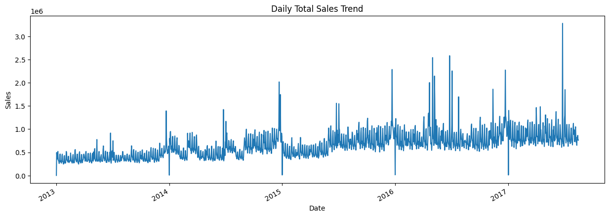
----
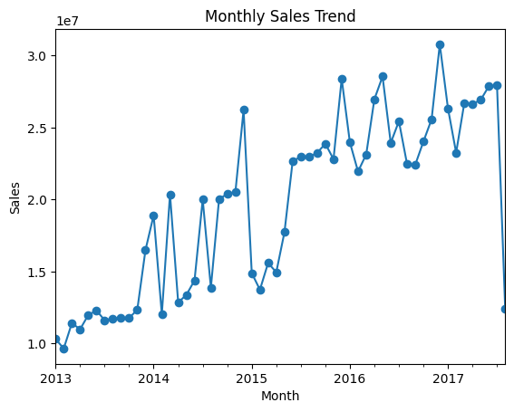
---
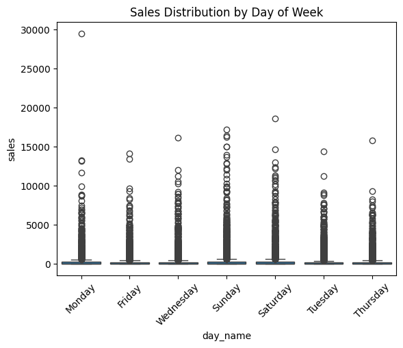
------
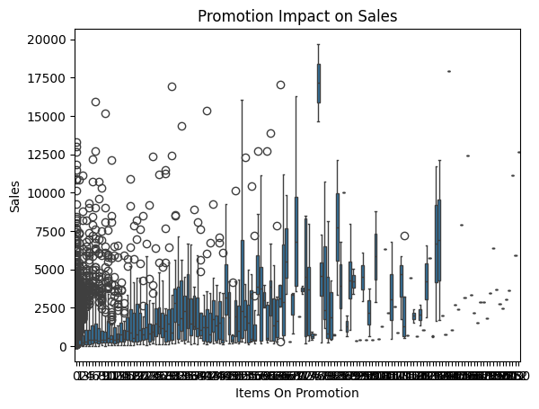
------
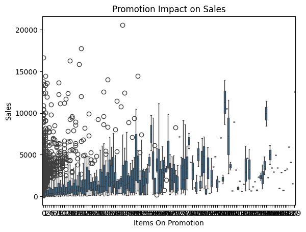
------
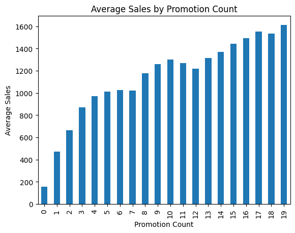
------
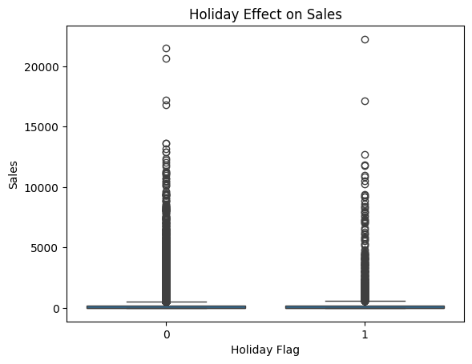
------
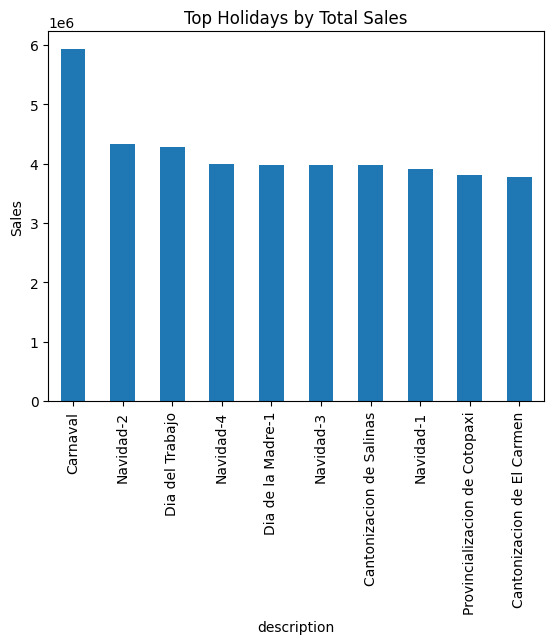
------
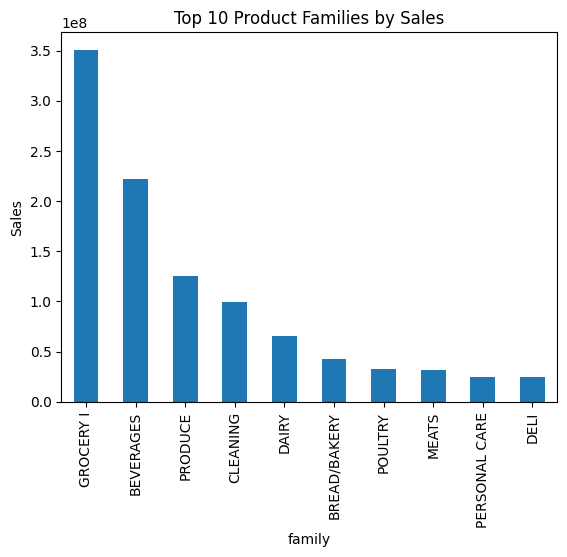
------
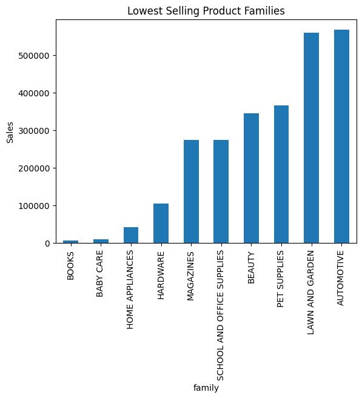
------
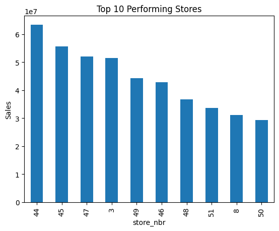
------
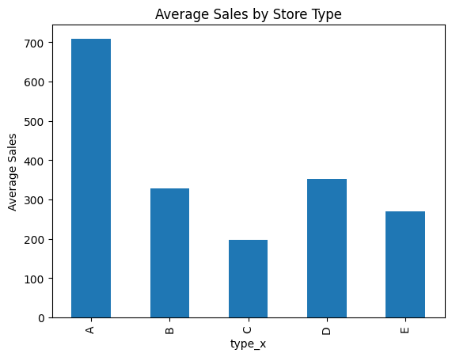
------
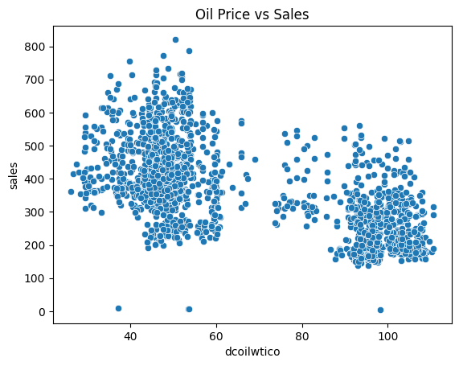
------
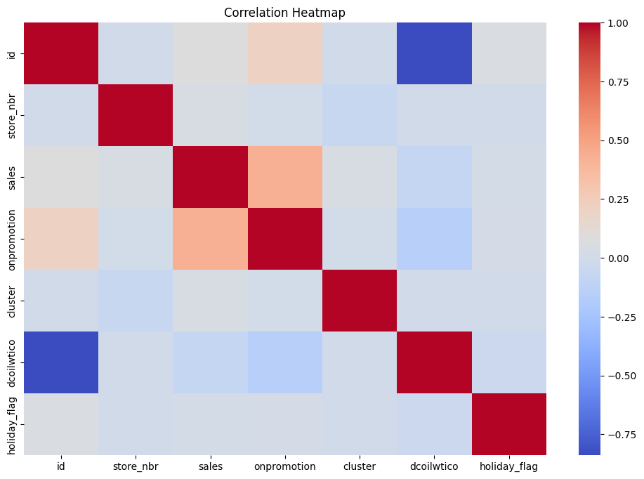

---

### 3️⃣ Feature Engineering
Created time-series and business features:

#### Time Features
- Year  
- Month  
- Day  
- Quarter  
- DayOfWeek  
- IsWeekend  

#### Lag Features
- Previous Day Sales (`lag_1`)  
- Previous Week Sales (`lag_7`)  

#### Rolling Statistics
- 7-Day Rolling Mean  

---

### 4️⃣ Model Training
Used **XGBoost Regressor** for forecasting future sales.

#### Why XGBoost?
- Excellent for structured/tabular data  
- Handles nonlinear relationships  
- Strong forecasting performance  
- Widely used in industry  

---

### 5️⃣ Forecast Generation
Predicted future sales for:

- Stores  
- Product Families  
- Future Dates  

---

### 6️⃣ Dashboard Visualization
Built an interactive **Power BI Dashboard** including:

- 📌 KPI Summary  
- 📈 Historical vs Forecast Trend  
- 🛒 Product Forecast Analysis  
- 🏪 Store Forecast Analysis  
- 🎯 Promotion/Holiday Insights  


### Power BI Dashboard Screenshots :

#### Executive Summary Dashboard :
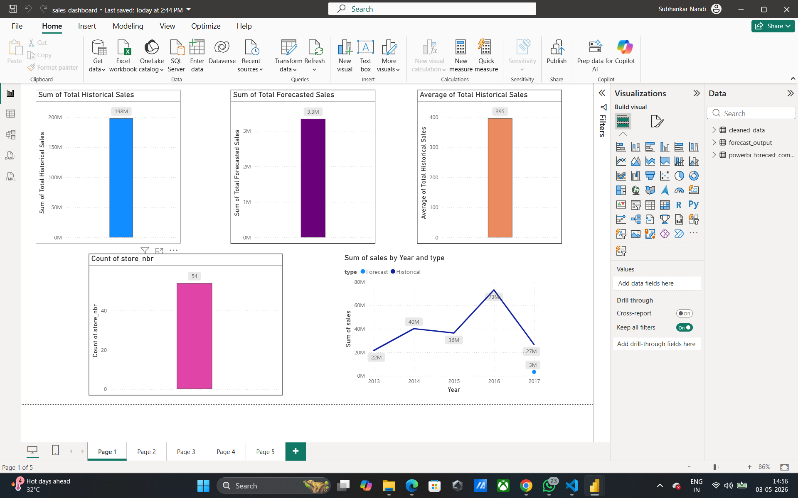
#### Forecast Analysis Dashboard :
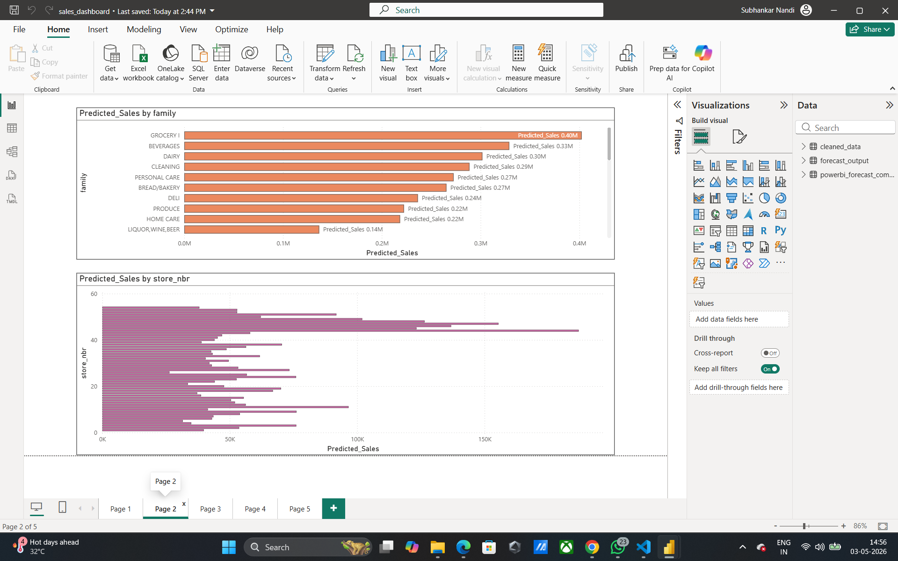
#### Historical Sales Analysis Dashboard : 
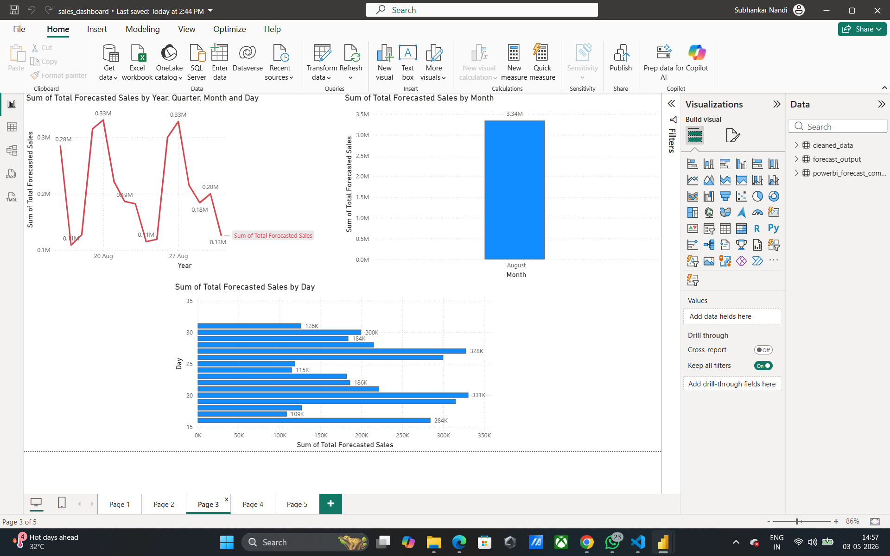
#### Promotion & Holiday Impact Dashboard :
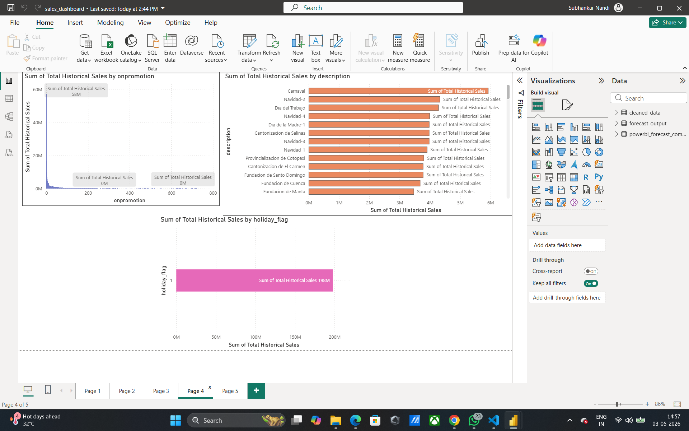
#### Product & Store Performance Dashboard :
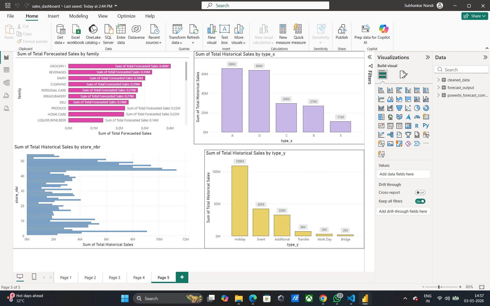


---

## 🤖 Model Details

### Model Used
**XGBoost Regressor**

### Hyperparameters

```python
XGBRegressor(
    n_estimators=300,
    learning_rate=0.05,
    max_depth=8,
    subsample=0.8,
    colsample_bytree=0.8
)
```

## 📏 Evaluation Metrics

Measured model performance using:

| Metric | Meaning |
|--------|---------|
| MAE | Mean Absolute Error |
| RMSE | Root Mean Squared Error |
| R² Score | Model Fit Score |

---

## 📊 Power BI Dashboard Features

### Executive Summary
- Total Historical Sales  
- Total Forecasted Sales  
- Average Daily Sales  
- Number of Stores  

### Forecast Analysis
- Historical vs Forecast Comparison  
- Forecast by Product Family  
- Forecast by Store  

### Business Driver Analysis
- Promotion Impact  
- Holiday Effect  
- Weekly/Monthly Trends  

---

## 💡 Key Business Insights

- 📈 Promotions significantly increase sales  
- 🎄 Holiday periods create strong demand spikes  
- 🛒 Certain product families dominate demand  
- 🏪 Some stores consistently outperform others  
- 📅 Sales exhibit clear weekly/monthly seasonality  

---

## ▶️ How to Run

### 1. Install Dependencies

```bash id="g9vs4s"
pip install -r requirements.txt
```
### 2. Run Full Pipeline

```bash
python src/preprocess.py
python src/feature_engineering.py
python src/train_model.py
python src/evaluate_model.py
python src/forecast.py
```
## 📁 Output Files

Generated Outputs:

| File | Purpose |
|------|--------|
| `cleaned_data.csv` | Processed historical dataset |
| `forecast_output.csv` | Predicted sales output |
| `powerbi_forecast_compare.csv` | Historical vs Forecast visualization |
| `xgboost_model.pkl` | Saved trained model |

---

## 🔮 Future Improvements

- Recursive forecasting for realistic lag generation  
- Hyperparameter tuning  
- TimeSeriesSplit validation  
- Ensemble forecasting models  
- Deploy as Streamlit web app  

---

## 👨‍💻 Author

**Subhankar Nandi**

---
